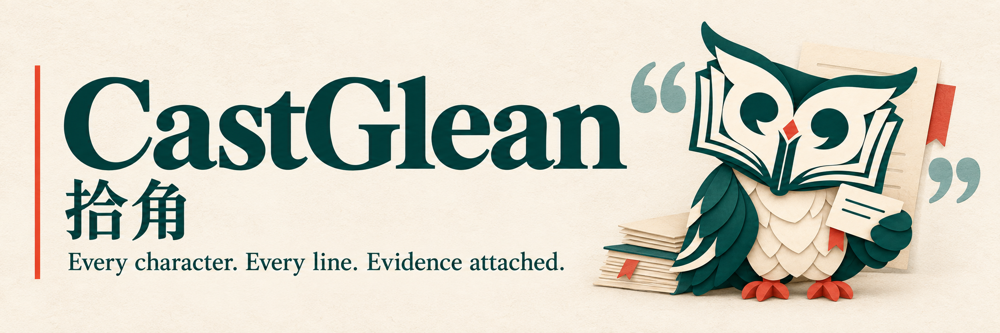
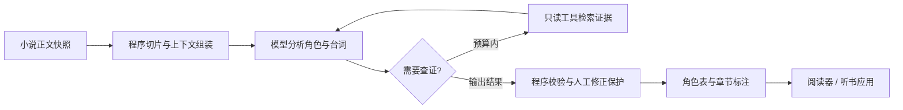

<p align="center">
  
</p>

# CastGlean · 拾角

**从原文拾取线索，让人物与台词有据可循。**

CastGlean 是一个开发中的 Rust 小说角色分析项目：将小说原文整理成稳定的角色表、可追溯的章节标注，以及可选的语义声音画像，为多角色听书和其他文本应用提供基础。当前已实现离线数据基础和单章固定分析，支持 GLM、本地 Qwen 服务及国内 MiniMax；已提供跨章快照、归属/别名修正、末章重分析及章节级运行恢复，声音画像分析留待后续。

*A Rust library and CLI for evidence-grounded novel annotations, with offline validation and bounded chapter analysis.*

[项目企划](docs/project-plan.md) · [实现路线图](docs/implementation-roadmap.md) · [最小数据示例](examples/minimal/README.md) · [品牌与资产](docs/brand.md) · [MIT License](LICENSE)

> **项目状态：阶段 A/B、阶段 C 最小闭环及 D 的章节级恢复已实现。** 提供正文快照、草案类型、JSON/Schema、原文及引用校验、通用库示例与 CLI。协议尚未冻结；跨运行缓存、窗口 checkpoint、任意旧章重跑、身份合并/撤销和 TRNovel 集成尚未实现，暂未发布可安装的程序。

模型分析支持 GLM、[本地 Qwen 服务](docs/local-model.md) 和 [国内 MiniMax](docs/minimax-model.md)。GLM 默认 low 思考和 JSON mode，本地默认关闭思考和 Schema 输出，MiniMax 分离思考与最终文本 JSON；均支持每窗口一次有限校验反馈修复（可关闭）。GLM 还可选择 Schema 或单工具提交，端点约束与样例对照见 [结构化输出验证](docs/structured-output.md)。版本 5 提示词增加证据优先规则；另可显式启用[原文引文模式](docs/quotation-evidence.md)，由程序精确定位并校验引用文字。来源校验不证明归属语义正确。

当前默认/引文提示词版本为 9/10，采用[窗口内短引用](docs/compact-window-references.md)，最终仍保存正式身份、片段 ID、原文摘要和字节范围。[208 次 Qwen/MiniMax/GLM 开发与小说对照](docs/compact-protocol-evaluation.md)已完成：GLM 默认小说组改善，其他后端与引文收益不一致，本地小说仍受输出预算限制。

[连续真实章节验证](docs/continuous-novel-verification.md)已补安全失败窗口与用量诊断、显式目标清单及完整遗漏反馈。修复后的两轮相同冻结三章均完整交付，重复恢复和整书校验通过，首章身份在后两章实际复用。两轮主角称呼候选数分别为 1/2/2、1/1/1，语义正确性未测；完整记录见验证文档，暂不冻结 v1。

提示词变化在本地与线上模型的真实对照见 [归属评测](docs/attribution-comparison.md)；小样本观察不构成真实小说的质量承诺。

[整章多角色交接](docs/chapter-consumption.md)已补齐只读消费契约、宿主选角示例及公开边界夹具。[增量章节交接](docs/incremental-delivery.md)提供经过校验的稳定前缀、宿主异步背压与取消，并通过离线测试；实际语音联调、增量持久化恢复与画像选角仍待后续验收。

## 为什么做

小说里同一个人可能叫“张三”“老张”或“张掌柜”；一句台词也可能没有直接点明说话人。多角色听书需要先识别这些关系，再把稳定的角色身份交给语音后端。

CastGlean 希望把这层分析做成独立、可检查、可修正的工具。角色表由应用保存，模型每次只读取必要上下文；更换模型或 TTS 后端时，角色身份和用户修正能够继续使用。

项目以独立、通用的 Rust library 为主要交付，同时提供调用同一套库能力的便捷 CLI。先验证独立分析能力，再接入计划中的首个使用方 TRNovel；公开 API 不绑定具体阅读器或 TTS。CLI 负责参数、配置和输出，业务逻辑进入库。

项目也是继续学习 [comfy-agent](https://github.com/yexiyue/comfy-agent) 的实践场景：先建立固定工作流，再用有预算的工具循环处理歧义，通过真实小说片段检验收益。

## 计划提供的能力

已实现能力与用法见 [离线格式与校验](docs/data-format.md)：保存规范化正文、校验人工标注，并通过 library 或 CLI 读取结果。Schema 检查结构，程序额外检查正文摘要、UTF-8 范围、完整覆盖、修订与跨章引用；结构正确不代表归属语义正确。

| 能力 | 设计目标 |
| --- | --- |
| 角色与别名 | 稳定角色 ID；重名或同称呼可以对应多个候选人物 |
| 台词归属 | 区分旁白、对话、心理活动和引述文本，保留未知或歧义 |
| 跨章记忆 | 角色事实与证据按章节保存，每次重建相关上下文 |
| 人工修正 | 修正拥有最高优先级，重新分析不静默覆盖 |
| 声音画像 | 可选、带证据的年龄段、性别和声线印象；缺失允许未知 |
| 模型接入 | 已接入 genai/GLM、本地 mistral.rs/Qwen 及国内 MiniMax 服务 |
| 有限工具循环 | 查询角色、阅读前文、检索证据；限制次数与作用域 |
| 持久化与恢复 | 版本化 JSON、缓存失效、执行记录和 checkpoint |

上表描述完整产品目标；单章固定分析、[跨章最小闭环](docs/cross-chapter.md)及[章节级恢复](docs/run-recovery.md)已可用，跨运行缓存、独立发布与工具检索继续按路线图推进。

## 从原文到标注



程序负责原文、ID、范围、校验和提交；模型负责语义判断。模型引用程序分配的片段 ID，不自行计算 UTF-8 字节偏移或改写朗读正文。

固定工作流是首条实现路径。工具循环作为后续可选模式，使用相同评测集对照准确率、未知比例、延迟和成本。

## 输出格式

采用自研 JSON，先满足本项目及使用方的需求。格式尚未冻结，不宣称兼容其他标注标准。

| 产物 | 用途 |
| --- | --- |
| `characters.json` | 角色 ID、姓名、别名、证据、修订和可选声音画像 |
| `<chapter>.annotations.json` | 正文哈希、片段范围、表达类型、角色归属和分析来源 |
| `<chapter>.txt` | 标注对应的不可变 UTF-8 正文快照 |

例如正文 `张三说：“走吧。”` 可以表达为：

| 片段 | 类型 | 归属 | UTF-8 字节范围 |
| --- | --- | --- | --- |
| `张三说：` | `narration` | 叙述功能，不将提到的张三设为旁白说话人 | `[0, 12)` |
| `“走吧。”` | `speech` | `char-001` → 张三 | `[12, 27)` |

查看 [完整示例文件](examples/minimal/README.md)。这些示例由人工构造，不是模型分析结果。

几个核心约定：

- 字节范围从 0 开始、左闭右开，并绑定明确的正文版本。
- 角色身份与旁白/对话功能分开；未知说话人不存成旁白。
- 同一个别名可对应多个角色，不能仅凭名称相似就合并。
- 标注不改变原文；角色事实、归属和声音画像均可附证据。
- 声音画像不包含后端音色 ID，也不根据名字猜测人物属性。

## 与 TRNovel 和 TTS 的关系

[TRNovel](https://github.com/yexiyue/TRNovel) 是计划中的第一个使用方，负责章节获取、阅读界面、选角、音色绑定、音频合成与播放。

外部集成放在独立能力验证之后，TRNovel 优先直接调用 Rust 库；JSON 产物同时用于离线交换、检查和 CLI 使用。具体接口与 TRNovel 的接入尚未实现。

CastGlean 提供稳定角色 ID 和分析结果。Qwen3-TTS、MOSS-TTS-Nano、Kokoro 等由使用方接入，具体音色资源不会进入分析协议。该集成目前尚未实现。

## 路线图

- [x] 项目命名、产品形象和基础资产。
- [x] 整理独立项目企划和手工数据示例。
- [x] Rust library + CLI 初始骨架，以及测试、格式、Clippy 和 rustdoc 检查配置。
- [x] **A — 数据基础**：不可变正文快照、草案格式、Schema、校验器、人工样例与离线 library/CLI。
- [x] **B — 固定分析**：GLM 接入、顺序窗口分析、建议校验和中文小样本基线。
- [x] **C — 最小身份与修正闭环**：有序整书快照、稳定身份、多候选查询、人工归属/别名修正、共同修订及末章重分析；[用法与边界](docs/cross-chapter.md)。
- [ ] **D — 可靠运行**：章节级持久化、配置指纹、checkpoint 和取消恢复已实现；跨运行缓存、协议冻结与独立发布验收后置。
- [ ] **E — 可选工具增强**：只读检索、硬预算、执行记录和对照评测。
- [ ] **F — 外部集成**：最后接入 TRNovel，按角色身份保持声音一致。

各阶段的实施顺序与验收标准见 [实现路线图](docs/implementation-roadmap.md)。工具增强不是交付或集成的前置条件。

阶段 B 的独立评测补充已提供 [标注政策](docs/annotation-policy.md)、40 个原创开发/留出场景和 [评分与运行工具](docs/attribution-evaluation.md)。[160 次 v1 实测报告](docs/attribution-evaluation-baseline.md) 区分格式交付、语义归属和身份对齐；复核发现的元数据不足另以冻结 v2 勘误保存，[344 次 v2 与小说引文对照](docs/quotation-evaluation.md)已完成：收益依赖后端，默认保留片段 ID 模式，本地小说仍受截断限制；另提供[六个网上小说连续片段](docs/literary-evaluation.md)，固定来源并独立冻结，作为补充组，不混入原创留出集。历史六例仍为单独回归组。

## 开始参与

当前可以克隆仓库阅读企划和示例：

```bash
git clone https://github.com/yexiyue/castglean.git
cd castglean
```

安装 Rust stable 工具链及本地平台链接工具后，可以运行当前骨架：

```bash
cargo run -- --help
cargo run -- --version
cargo run -- validate --characters examples/minimal/characters.json --annotations examples/minimal/chapter.annotations.json --source examples/minimal/chapter.txt
cargo run -p castglean-core --example validate_sample
cargo run -p castglean-core --example analyze_offline
cargo test --workspace --all-targets --locked
```

目录、技术栈和完整检查命令见 [工程说明](docs/engineering.md)，离线入口见 [格式与使用说明](docs/data-format.md)。`analyze` 已实现（见 [模型分析用法](docs/model-analysis.md) 和 [阶段 B 基线](docs/stage-b-baseline.md)）；`inspect`、`correct` 和整书 `validate --book-file` 已实现，见 [跨章用法](docs/cross-chapter.md)；`run`、`resume` 和 `run-inspect` 已实现，见 [运行恢复](docs/run-recovery.md)；`validate` 继续支持显式文件输入，协议仍为草案，首个对外发布前再冻结 v1。

欢迎通过 Issue 讨论中文台词归属、别名冲突、人工修正和格式设计，也欢迎提供允许公开分发的小型测试场景。后续评测将分别记录归属准确率、未知比例和原文完整性，不以 JSON 格式正确代替语义正确。

## 品牌

**Cast + Glean**：故事中的人物，与从文本中拾取线索。中文名“拾角”表示从文字里找回人物身份。

吉祥物“拾拾”是一只纸页猫头鹰，书页轮廓与引号眼睛呼应阅读和台词，证据卡代表可追溯的判断。

<p align="center">
  
</p>

品牌色、使用规范和生成提示词见 [品牌文档](docs/brand.md)。

## 许可证

[MIT](LICENSE)。仓库中的品牌图片由 AI 辅助生成，生成记录随仓库保存；第三方模型和语料遵循各自许可证，本仓库不附带模型权重或完整小说；评测中的精选公有领域片段保留出处及许可说明。
