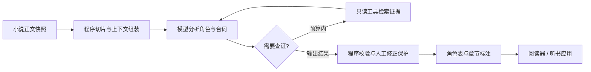

<p align="center">
  
</p>

# CastGlean · 拾角

**从原文拾取线索，让人物与台词有据可循。**

CastGlean 是一个规划中的 Rust 小说角色分析项目：将小说原文整理成稳定的角色表、可追溯的章节标注，以及可选的语义声音画像，为多角色听书和其他文本应用提供基础。

*An evidence-grounded character and dialogue attribution project for novels, planned as a Rust library and CLI.*

[项目企划](docs/project-plan.md) · [最小数据示例](examples/minimal/README.md) · [品牌与资产](docs/brand.md) · [MIT License](LICENSE)

> **项目状态：初始工程骨架。** 已建立 Rust library + CLI、基础进程测试和 CI 配置；CLI 当前仅支持帮助与版本信息。分析器、格式校验器、模型适配和 TRNovel 集成尚未实现，暂未发布可安装的程序。

## 为什么做

小说里同一个人可能叫“张三”“老张”或“张掌柜”；一句台词也可能没有直接点明说话人。多角色听书需要先识别这些关系，再把稳定的角色身份交给语音后端。

CastGlean 希望把这层分析做成独立、可检查、可修正的工具。角色表由应用保存，模型每次只读取必要上下文；更换模型或 TTS 后端时，角色身份和用户修正能够继续使用。

项目以可嵌入的 Rust library 为主要交付，同时提供调用同一套库能力的便捷 CLI。首批核心使用方是 TRNovel，公开 API 优先围绕它的章节分析与多角色听书需求设计；CLI 负责参数、配置和输出，业务逻辑进入库。

项目也是继续学习 [comfy-agent](https://github.com/yexiyue/comfy-agent) 的实践场景：先建立固定工作流，再用有预算的工具循环处理歧义，通过真实小说片段检验收益。

## 计划提供的能力

| 能力 | 设计目标 |
| --- | --- |
| 角色与别名 | 稳定角色 ID；重名或同称呼可以对应多个候选人物 |
| 台词归属 | 区分旁白、对话、心理活动和引述文本，保留未知或歧义 |
| 跨章记忆 | 角色事实与证据按章节保存，每次重建相关上下文 |
| 人工修正 | 修正拥有最高优先级，重新分析不静默覆盖 |
| 声音画像 | 可选、带证据的年龄段、性别和声线印象；缺失允许未知 |
| 模型接入 | 规划采用 genai，接入本地服务与线上 API |
| 有限工具循环 | 查询角色、阅读前文、检索证据；限制次数与作用域 |
| 持久化与恢复 | 版本化 JSON、缓存失效、执行记录和 checkpoint |

以上均为规划能力，实际交付按下方路线图推进。

## 从原文到标注



程序负责原文、ID、范围、校验和提交；模型负责语义判断。模型引用程序分配的片段 ID，不自行计算 UTF-8 字节偏移或改写朗读正文。

固定工作流是首条实现路径。工具循环作为后续可选模式，使用相同评测集对照准确率、未知比例、延迟和成本。

## 输出格式

采用自研 JSON，先满足本项目及使用方的需求。格式尚未冻结，不宣称兼容其他标注标准。

| 产物 | 用途 |
| --- | --- |
| `characters.json` | 角色 ID、姓名、别名、证据、修订和可选声音画像 |
| `<chapter>.annotations.json` | 正文哈希、片段范围、表达类型、角色归属和分析来源 |
| `<chapter>.txt` | 标注对应的不可变 UTF-8 正文快照 |

例如正文 `张三说：“走吧。”` 可以表达为：

| 片段 | 类型 | 归属 | UTF-8 字节范围 |
| --- | --- | --- | --- |
| `张三说：` | `narration` | 叙述功能，不将提到的张三设为旁白说话人 | `[0, 12)` |
| `“走吧。”` | `speech` | `char-001` → 张三 | `[12, 27)` |

查看 [完整示例文件](examples/minimal/README.md)。这些示例由人工构造，不是模型分析结果。

几个核心约定：

- 字节范围从 0 开始、左闭右开，并绑定明确的正文版本。
- 角色身份与旁白/对话功能分开；未知说话人不存成旁白。
- 同一个别名可对应多个角色，不能仅凭名称相似就合并。
- 标注不改变原文；角色事实、归属和声音画像均可附证据。
- 声音画像不包含后端音色 ID，也不根据名字猜测人物属性。

## 与 TRNovel 和 TTS 的关系

[TRNovel](https://github.com/yexiyue/TRNovel) 是计划中的第一个使用方，负责章节获取、阅读界面、选角、音色绑定、音频合成与播放。

首批集成优先直接调用 Rust 库，JSON 产物同时用于离线交换、检查和 CLI 使用。具体接口与 TRNovel 的接入尚未实现。

CastGlean 提供稳定角色 ID 和分析结果。Qwen3-TTS、MOSS-TTS-Nano、Kokoro 等由使用方接入，具体音色资源不会进入分析协议。该集成目前尚未实现。

## 路线图

- [x] 项目命名、产品形象和基础资产。
- [x] 整理独立项目企划和手工数据示例。
- [x] Rust library + CLI 初始骨架，以及测试、格式、Clippy 和 rustdoc 检查配置。
- [ ] **A — 数据基础**：Rust library + CLI 骨架、v1 格式、Schema 和校验器。
- [ ] **B — 固定分析**：模型服务接入、场景分析、结构化输出和中文基线评测。
- [ ] **C — 角色记忆**：跨章身份、证据、人工修正、缓存与修订。
- [ ] **D — 工具循环**：只读检索、预算、执行记录、取消与恢复。
- [ ] **E — 实际接入**：TRNovel 消费标注，按角色身份保持声音一致。

## 开始参与

当前可以克隆仓库阅读企划和示例：

```bash
git clone https://github.com/yexiyue/castglean.git
cd castglean
```

安装 Rust stable 工具链及本地平台链接工具后，可以运行当前骨架：

```bash
cargo run -- --help
cargo run -- --version
cargo test --workspace --all-targets --locked
```

目录、技术栈建议和完整检查命令见 [工程说明](docs/engineering.md)。CLI 分析命令设计见 [项目企划](docs/project-plan.md)，其中 `analyze`、`validate` 等仍为拟议接口；现有模块仅预留职责，阶段 A 尚未完成。

欢迎通过 Issue 讨论中文台词归属、别名冲突、人工修正和格式设计，也欢迎提供允许公开分发的小型测试场景。后续评测将分别记录归属准确率、未知比例和原文完整性，不以 JSON 格式正确代替语义正确。

## 品牌

**Cast + Glean**：故事中的人物，与从文本中拾取线索。中文名“拾角”表示从文字里找回人物身份。

吉祥物“拾拾”是一只纸页猫头鹰，书页轮廓与引号眼睛呼应阅读和台词，证据卡代表可追溯的判断。

<p align="center">
  
</p>

品牌色、使用规范和生成提示词见 [品牌文档](docs/brand.md)。

## 许可证

[MIT](LICENSE)。仓库中的品牌图片由 AI 辅助生成，生成记录随仓库保存；第三方模型和语料遵循各自许可证，本仓库不附带模型权重或小说数据集。
