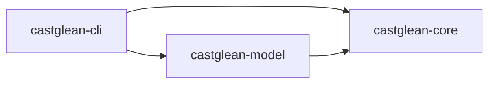

# 初始工程与技术栈

阶段 A 已实现独立 library 与 CLI 离线校验，阶段 B 已实现 GLM 单章固定分析。CLI 提供帮助、版本、validate 和 analyze；跨章身份管理、人工修正和恢复仍在规划中。协议尚未冻结，详见 [格式与用法](data-format.md) 和 [模型分析](model-analysis.md)。

## 工程组织

按当前选择建立三个 crate 的 Cargo workspace：`castglean-core`、`castglean-model`、`castglean-cli`。CLI 的二进制名仍为 `castglean`，它是默认运行目标。当前使用 Rust 2024 edition、resolver 3 和 stable 工具链；提交 `Cargo.lock` 固定应用依赖解析。尚未声明或验证最低 Rust 版本。

| 路径 | 职责与状态 |
| --- | --- |
| `crates/core/src/lib.rs` | 内部模块私有，显式导出离线类型与函数 |
| `crates/core/src/domain.rs` | 已实现草案角色、片段、归属、证据及独立 ID 类型 |
| `crates/core/src/document.rs` | 已实现不可变快照、换行规范化、摘要及字节范围 |
| `crates/core/src/validation.rs` | 已实现完整集合校验与只读结果 |
| `crates/core/src/error.rs` | 结构化 JSON / 校验错误 |
| `crates/core/src/analysis.rs`、`analysis/` | 章节编排、确定性分区、建议协议、有界窗口修复与纯校验 |
| `crates/core/src/memory.rs` | 预留角色索引、场景状态和证据检索 |
| `crates/core/src/storage.rs` | 已实现 JSON 流读写及 Schema 导出；事务、缓存、恢复后置 |
| `crates/core/src/agent.rs` | 预留后续有预算的只读工具循环 |
| `crates/model/src/lib.rs`、`glm.rs` | 显式 GLM 配置、genai 文本调用、用量与安全错误转换 |
| `crates/cli/src/` | 帮助、版本、显式文件 validate 与 analyze、环境文件和新目录发布 |
| `crates/core/tests/`、`crates/cli/tests/` | 领域、Schema、公开样例及 CLI 进程测试 |
| `crates/core/examples/` | 可运行的库使用与显式 Schema 导出示例 |
| `examples/`、`schemas/` | 三个公开场景、无效样例与生成 Schema，协议尚未冻结 |
| `.github/workflows/ci.yml` | Windows / Linux 测试、格式、Clippy、rustdoc 配置 |

core 不依赖模型厂商 SDK；model 依赖 core；CLI 装配两者。当前不引入 HTTP 服务或前端工程。



固定流程位于 core，最小 `AnalysisModel` 接口由 model 实现，测试替身可离线使用。接口使用返回 Send future 的泛型 trait，复用宿主 Tokio 运行时，不引入通用 agent 框架。

分析内部按职责分模块：`analysis.rs` 定义公开入口并编排章节；`partition.rs` 管分区；`protocol.rs` 管建议 DTO、Schema 和请求提示词；`window.rs` 管单窗口调用、有限修复、预算与取消；`suggestions.rs` 纯校验并转换为私有已校验窗口，随后消费应用；`issue.rs` 管安全类型化反馈。校验不接收可变状态，模型适配器不决定业务接受条件；内部模块不成为公开命名空间。

## 独立 Library 与宿主边界

主要交付是独立、通用的 Rust 库，同时提供便捷 CLI。core 提供正文、角色与标注类型、校验及工作流；model 提供模型适配；CLI 仅负责参数、配置加载、装配和终端输出，复用库 API。先在本项目内完成独立能力验收，最后接入计划中的首个使用方 TRNovel。当前保留三包，不额外增加空门面 crate；若真实使用证明需要单一入口，再评估增加 `castglean` 门面包。

CastGlean 后续异步 API 应能在宿主已有运行时内调用，库不自行启动嵌套运行时，也不安装进程级日志订阅器或信号处理器。最低 Rust 版本由本项目依赖和验证结果决定，正式声明前须测试；具体消费方的工具链兼容性在最后的集成阶段确认。

以下为库 API 的边界约束；分析、显式配置与取消已实现，修正及状态提交仍待后续：

- 接收调用方提供的章节 ID、正文和书籍状态，不要求宿主先写临时文件或启动 CLI 子进程。JSON 导入/导出作为配套能力。
- 配置与模型客户端由调用方显式提供；库不自动读取 `.env`、修改当前目录、决定宿主缓存路径或直接打印终端输出。
- 返回结构化标注、角色更新与可区分的错误；按实际需要提供进度与取消接口，支持不同宿主的后台任务。取消后的迟到结果不能提交。
- 持久化路径与书籍状态由调用方管理，库提供校验及可复用的提交机制；CLI 和其他宿主共享相同修正保护规则。
- 使用正文摘要与 UTF-8 字节范围定位，归属仅引用稳定角色身份；具体音色绑定、TTS 与播放由使用方负责。
- 核心 API 不包含特定阅读器的类型、缓存目录或事件协议。外部文本预处理后的坐标映射由集成层明确处理，不能把音频片段序号直接当作原文范围。

独立库提供 `validate_sample` 和 `analyze_offline` 示例，分别演示读取已校验结果及异步模型接口。TRNovel 的实际接入与 TTS 改动位于 [实现路线图](implementation-roadmap.md) 最后的 F 阶段。

## Rust 目录与模块约定

采用 Rust 官方当前推荐的新项目模块文件布局：`document.rs` 表示模块入口；出现实际子模块后，再增加 `document/normalize.rs`、`document/segment.rs` 等文件，由 `document.rs` 声明。避免仅为了一个模块入口创建目录。`mod.rs` 仍受支持，本项目统一选择具名文件，便于编辑器定位。[模块文件指南](https://doc.rust-lang.org/stable/book/ch07-05-separating-modules-into-different-files.html)

三个 crate 的划分是本项目的工程决策：core 管领域与用例，model 管外部模型适配，CLI 管进程入口和装配。core 的 storage 已提供 JSON 流读写和 Schema；以后文件 IO 或依赖复杂度确有隔离需求时再评估拆包，不提前增加空 crate。workspace 集中维护 edition、版本、依赖和 lint，各成员显式继承；保留 resolver 3 与共享锁文件。[Cargo workspace 指南](https://doc.rust-lang.org/cargo/reference/workspaces.html)

模块默认私有，仅为跨模块访问使用 `pub(crate)`，面向使用方的类型和函数通过 `lib.rs` 的 `pub use` 导出。有意提供模块命名空间时才用 `pub mod`，避免把内部文件布局提前变成公开 API。当前已实现模块与预留模块均保持私有，公开 API 仍处于草案阶段。

领域类型实现时，为角色 ID、章节 ID 等不同概念考虑 newtype；正文范围、已校验结果等具有不变量的类型使用私有字段与校验构造函数。JSON 输入 DTO 与已验证领域对象按需要分离，反序列化成功不能直接代表业务校验成功。被动数据对象是否使用公开字段按其约束决定，不机械地封装所有字段。[类型安全](https://rust-lang.github.io/api-guidelines/type-safety.html)、[API 演进与私有字段](https://rust-lang.github.io/api-guidelines/future-proofing.html)

测试按作用域放置：模块内部单元测试用 `#[cfg(test)] mod tests`；跨公开 API 的集成测试放在各 crate 的 `tests/`；CLI 保留进程级测试。公开 API 出现后补充 rustdoc 示例与 doctest，CI 同时运行 `cargo test --workspace --doc --locked`。测试正文使用允许公开分发的短样例，不把私人小说放入 fixtures。

这些约定不要求一个文件只放一个类型，也不预设层层 trait、通用 `utils` 模块或单独的 agent 框架；按职责和实际复杂度拆分文件与抽象。

## 依赖选择

| 层次 | 建议 | 引入时机 |
| --- | --- | --- |
| CLI | clap 4 derive | 已引入，用于帮助和版本 |
| JSON | serde + serde_json | 已引入；严格 DTO 与流读写 |
| Schema | schemars | 已引入；生成并测试同步 |
| 正文摘要 | sha2 | 已引入；绑定原文快照 |
| 错误 | thiserror | 已引入；库和 CLI 保留诊断位置及错误类别 |
| 模型 | genai =0.7.0-rc.1 | 已引入，与 comfy-agent 使用版本一致 |
| 异步与超时 | Tokio + tokio-util | 已引入；库只启用流程所需能力，运行时与信号由 CLI/宿主管理 |
| 环境配置 | dotenvy | CLI 解析文件，不修改全局环境 |
| 诊断 | 安全类别 + JSON 用量统计 | 已实现；tracing 尚未引入 |
| 持久化 | 版本化 JSON + 正文文件 | 阶段 A；原子提交协议单独设计 |

参考：[Cargo resolver](https://doc.rust-lang.org/stable/edition-guide/rust-2024/cargo-resolver.html)、[clap derive](https://docs.rs/clap/latest/clap/_derive/)、[serde](https://docs.rs/serde/latest/serde/)、[schemars](https://docs.rs/schemars/latest/schemars/)、[genai](https://docs.rs/genai/latest/genai/)、[Tokio](https://docs.rs/tokio/latest/tokio/)。jsonschema 仅为离线 Schema 测试依赖，关闭默认网络解析 feature；tempfile 用于 CLI 临时发布目录和测试。genai、Tokio 已加入，dotenvy 只由 CLI 使用；tracing 尚未引入。

## 本地开发

```bash
cargo run -- --help
cargo run -- --version
cargo fmt --all -- --check
cargo test --workspace --all-targets --locked
cargo clippy --workspace --all-targets --locked -- -D warnings
```

rustdoc 检查（PowerShell）：

```powershell
$env:RUSTDOCFLAGS = '-D warnings'
cargo doc --workspace --no-deps --locked
```

首次构建需要下载依赖并具备本地平台链接工具链。`validate` 可完全离线；`analyze` 需要显式 GLM 配置或 CLI 环境文件。详细命令见 [模型分析](model-analysis.md)。

## 下一步讨论

阶段 A/B 已完成离线与固定分析闭环；下一步进入 C 阶段身份与修正。Schema 的结构检查继续与跨文件和原文坐标校验分开，模型输出不直接提交。

后续依次完成跨章身份与修正、可靠运行、可选工具增强，最后进行外部集成。详细顺序和阶段验收以 [实现路线图](implementation-roadmap.md) 为准。

阶段 B 已引入 genai 与 Tokio，首个模型接入参考 `../rust-agent/comfy-agent` 已有的 GLM 配置。已核对其 `Cargo.toml` 和 `crates/agent/src/config.rs`：使用 `genai = "0.7.0-rc.1"`，读取 `MODEL`、`API_BASE_URL`，代码默认模型为 `bigmodel::glm-4.6`，BigModel 默认端点为 `https://open.bigmodel.cn/api/coding/paas/v4/`，通过 `ServiceTargetResolver` 覆写端点。这是该项目的代码默认值；本次经用户授权只迁移三个 GLM 配置项到本地 .env，实际运行模型和基线见 [评测报告](stage-b-baseline.md)。

已复用其模型请求与配置机制，独立接入本项目；端点应显式配置并确认适用于当前账号与任务，不将 Coding 端点自动用于所有 GLM 服务。凭据继续使用外部环境配置，不复制进 Git。CLI 已加载上述变量并跑通真实 GLM，库使用显式认证和端点，不隐式读取环境。固定流程已建立小样本基线，工具循环仍待后续评测决定。
