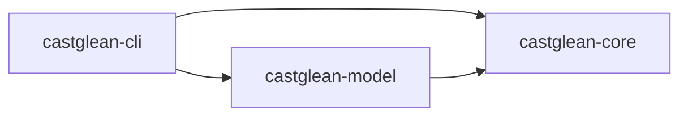

# 初始工程与技术栈

当前已建立可编译的 library + CLI 骨架；CLI 只支持帮助与版本信息。模块文件仅说明职责，尚未提供业务 API。模型接入、数据格式与校验器仍处于规划阶段。

## 工程组织

按当前选择建立三个 crate 的 Cargo workspace：`castglean-core`、`castglean-model`、`castglean-cli`。CLI 的二进制名仍为 `castglean`，它是默认运行目标。当前使用 Rust 2024 edition、resolver 3 和 stable 工具链；提交 `Cargo.lock` 固定应用依赖解析。尚未声明或验证最低 Rust 版本。

| 路径 | 职责与状态 |
| --- | --- |
| `crates/core/src/lib.rs` | 核心库入口；内部模块保持私有，尚无公开业务 API |
| `crates/core/src/domain.rs` | 预留角色身份、片段、归属、证据、修订 |
| `crates/core/src/document.rs` | 预留正文快照、规范化、切片、字节坐标 |
| `crates/core/src/analysis.rs` | 预留固定流程、上下文组装和应用校验 |
| `crates/core/src/memory.rs` | 预留角色索引、场景状态和证据检索 |
| `crates/core/src/storage.rs` | 预留 JSON 提交、修订、缓存和恢复 |
| `crates/core/src/agent.rs` | 预留后续有预算的只读工具循环 |
| `crates/model/src/lib.rs` | 预留模型服务适配和能力配置 |
| `crates/cli/src/` | 已实现帮助、版本及进程入口 |
| `crates/cli/tests/` | CLI 进程测试；领域测试随实际实现补充 |
| `examples/minimal/` | 已有人工示例，协议尚未冻结 |
| `.github/workflows/ci.yml` | Windows / Linux 测试、格式、Clippy、rustdoc 配置 |

core 不依赖模型厂商 SDK；model 依赖 core；CLI 依赖二者，后续负责装配配置和模型实现。目前 path 依赖仅预留装配关系，没有业务调用。当前不引入 HTTP 服务或前端工程。



固定流程位于 core，进入阶段 B 时再按实际调用需求定义最小模型接口，由 model 实现；不在骨架阶段冻结异步 trait 或通用 agent 框架。

## Library 优先与 TRNovel 集成

主要交付是可嵌入 Rust 应用的库，同时提供便捷 CLI。首批核心使用方为 `../TRNovel`，集成方向优先采用进程内库调用。core 提供正文、角色与标注类型、校验及工作流；model 提供模型适配；CLI 仅负责参数、配置加载、装配和终端输出，复用库 API。当前保留三包，不额外增加空门面 crate；若真实接入证明需要单一入口，再评估增加 `castglean` 门面包。

已检查 TRNovel 本地代码：它是 Rust 2024 的终端阅读器，声明 `rust-version = "1.89"`，已使用 Tokio；`novel-tts` 管理章节合成、取消和播放。CastGlean 后续异步 API 应能在宿主已有运行时内调用，库不自行启动嵌套运行时，也不安装进程级日志订阅器或信号处理器。Rust 1.89 作为消费方兼容性评估目标，当前尚未进行对应工具链测试，不能宣称已支持该最低版本。

以下为后续库 API 的设计约束，尚未实现：

- 接收调用方提供的章节 ID、正文和书籍状态，不要求 TRNovel 先写临时文件或启动 CLI 子进程。JSON 导入/导出作为配套能力。
- 配置与模型客户端由调用方显式提供；库不自动读取 `.env`、修改当前目录、决定宿主缓存路径或直接打印终端输出。
- 返回结构化标注、角色更新与可区分的错误；按实际需要提供进度与取消接口，便于阅读器后台任务接入。取消后的迟到结果不能提交。
- 持久化路径与书籍状态由调用方管理，库提供校验及可复用的提交机制；避免 CLI 和 TRNovel 各自维护一套修正保护规则。
- 使用正文摘要与 UTF-8 字节范围定位，归属仅引用稳定角色身份；音色绑定、TTS 与播放仍由 TRNovel 负责。
- TRNovel 的阅读正文、CastGlean 的规范化快照和 TTS 预处理文本须确认版本及坐标映射，不能把音频片段序号直接当作原文范围。

首批消费验收应包含可运行的 Rust 集成示例：提供一个短章节，调用库校验并读取按原文顺序的角色归属；阶段 B 再演示异步分析及取消。该示例在库 API 实现后加入，当前不提供无法编译的伪调用。TRNovel 的实际接入与 TTS 改动仍在后续阶段。

## Rust 目录与模块约定

采用 Rust 官方当前推荐的新项目模块文件布局：`document.rs` 表示模块入口；出现实际子模块后，再增加 `document/normalize.rs`、`document/segment.rs` 等文件，由 `document.rs` 声明。避免仅为了一个模块入口创建目录。`mod.rs` 仍受支持，本项目统一选择具名文件，便于编辑器定位。[模块文件指南](https://doc.rust-lang.org/stable/book/ch07-05-separating-modules-into-different-files.html)

三个 crate 的划分是本项目的工程决策：core 管领域与用例，model 管外部模型适配，CLI 管进程入口和装配。core 的 storage 当前仅为规划占位；以后文件 IO 或依赖复杂度确有隔离需求时再评估拆包，不提前增加空 crate。workspace 集中维护 edition、版本、依赖和 lint，各成员显式继承；保留 resolver 3 与共享锁文件。[Cargo workspace 指南](https://doc.rust-lang.org/cargo/reference/workspaces.html)

模块默认私有，仅为跨模块访问使用 `pub(crate)`，面向使用方的稳定类型和函数通过 `lib.rs` 的 `pub use` 导出。有意提供模块命名空间时才用 `pub mod`，避免把内部文件布局提前变成公开 API。目前 core 的六个占位模块均为私有。

领域类型实现时，为角色 ID、章节 ID 等不同概念考虑 newtype；正文范围、已校验结果等具有不变量的类型使用私有字段与校验构造函数。JSON 输入 DTO 与已验证领域对象按需要分离，反序列化成功不能直接代表业务校验成功。被动数据对象是否使用公开字段按其约束决定，不机械地封装所有字段。[类型安全](https://rust-lang.github.io/api-guidelines/type-safety.html)、[API 演进与私有字段](https://rust-lang.github.io/api-guidelines/future-proofing.html)

测试按作用域放置：模块内部单元测试用 `#[cfg(test)] mod tests`；跨公开 API 的集成测试放在各 crate 的 `tests/`；CLI 保留进程级测试。公开 API 出现后补充 rustdoc 示例与 doctest，CI 同时运行 `cargo test --workspace --doc --locked`。测试正文使用允许公开分发的短样例，不把私人小说放入 fixtures。

这些约定不要求一个文件只放一个类型，也不预设层层 trait、通用 `utils` 模块或单独的 agent 框架；按职责和实际复杂度拆分文件与抽象。

## 依赖选择

| 层次 | 建议 | 引入时机 |
| --- | --- | --- |
| CLI | clap 4 derive | 已引入，用于帮助和版本 |
| JSON | serde + serde_json | 阶段 A 定义领域类型时 |
| Schema | schemars | 阶段 A；从类型生成后同时审查版本协议 |
| 正文摘要 | sha2 | 阶段 A；摘要绑定保存的正文快照 |
| 错误 | thiserror；CLI 按需要用 anyhow | 首个业务 API；保留可区分的领域错误 |
| 模型 | genai | 阶段 B；核对版本和服务能力后锁定 |
| 异步与超时 | Tokio，按需要开启 feature | 阶段 B |
| 诊断 | tracing + tracing-subscriber | 阶段 B；日志避免正文和凭据 |
| 持久化 | 版本化 JSON + 正文文件 | 阶段 A；原子提交协议单独设计 |

参考：[Cargo resolver](https://doc.rust-lang.org/stable/edition-guide/rust-2024/cargo-resolver.html)、[clap derive](https://docs.rs/clap/latest/clap/_derive/)、[serde](https://docs.rs/serde/latest/serde/)、[schemars](https://docs.rs/schemars/latest/schemars/)、[genai](https://docs.rs/genai/latest/genai/)、[Tokio](https://docs.rs/tokio/latest/tokio/)。这些选择中除 clap 外均未加入依赖，避免骨架携带尚未使用的服务栈。企划使用 genai 的预发布版本，进入模型实现时须核对对应版本，而不是仅依赖 `latest` 文档。

## 本地开发

```bash
cargo run -- --help
cargo run -- --version
cargo fmt --all -- --check
cargo test --workspace --all-targets --locked
cargo clippy --workspace --all-targets --locked -- -D warnings
```

rustdoc 检查（PowerShell）：

```powershell
$env:RUSTDOCFLAGS = '-D warnings'
cargo doc --workspace --no-deps --locked
```

首次构建需要下载依赖并具备本地平台链接工具链。`analyze`、`validate` 等企划命令尚未实现，会返回参数错误。

## 下一步讨论

先实现阶段 A 的离线闭环：明确规范化规则与正文哈希，确定最小领域类型和 JSON 版本策略，再对人工样例检查 Unicode 边界、覆盖、角色与证据引用。Schema 的结构检查不能替代跨文件和原文坐标校验。

阶段 B 才引入 genai 与 Tokio。首个模型接入优先参考 `../rust-agent/comfy-agent` 已有的 GLM 配置。已核对其 `Cargo.toml` 和 `crates/agent/src/config.rs`：使用 `genai = "0.7.0-rc.1"`，读取 `MODEL`、`API_BASE_URL`，代码默认模型为 `bigmodel::glm-4.6`，BigModel 默认端点为 `https://open.bigmodel.cn/api/coding/paas/v4/`，通过 `ServiceTargetResolver` 覆写端点。这是该项目的代码默认值，并不代表已读取其私有配置或核实实际运行模型。

后续复用其模型请求与配置机制，独立接入本项目；端点应显式配置并确认适用于当前账号与任务，不将 Coding 端点自动用于所有 GLM 服务。凭据继续使用外部环境配置，不复制进 Git。初始骨架尚未加载上述变量，也未调用 GLM；模型版本、预算和能力验收留到阶段 B。固定流程建立基线后，再评估工具循环。
