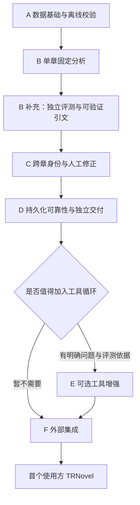

# CastGlean 实现路线图

日期：2026-10-09。状态：阶段 A/B、阶段 C 最小闭环及阶段 D 的章节级恢复已实现；阶段 D 的独立交付验收继续推进，阶段 E/F 后置。阶段 A 的用法、约束与格式见 [离线数据格式草案](data-format.md)，协议尚未冻结。

CastGlean 首先交付独立、通用的小说角色与台词分析库，同时提供复用相同能力的 CLI。先在本项目内验证数据、分析、状态与可靠性，再集成外部应用。TRNovel 是计划中的首个使用方，实际接入放在最后，不决定核心类型、配置路径、存储方式或音色协议。

本路线图负责实现顺序与阶段验收；功能背景见 [项目企划](project-plan.md)，目录与依赖约定见 [工程说明](engineering.md)。阶段按验收推进，不承诺日历排期。

## 推进顺序

阶段 B 已补充本地 mistral.rs/Qwen3-14B 接入，复用既有固定窗口、Schema 与程序校验；用法及默认预算见 [本地模型](local-model.md)。模型进程管理和嵌入式 GPU 推理不属于当前核心能力。

阶段 B 的可靠性补充还包括证据优先提示词版本 5、国内 MiniMax 适配和六个公开场景的前后对照。核心继续使用固定编排及有限校验修复；语义指导不构成自动证明归属的条件，也不提前引入阶段 E 的工具循环。

历史实测记录见 [提示词与模型对照](attribution-comparison.md)。阶段 B 的独立评测补充已提供 [标注政策](annotation-policy.md)、四十例冻结原创语料与 [独立评分工具](attribution-evaluation.md)，开发及留出各二十例。验收分别记录格式交付、语义归属与身份匹配不确定性，不能把格式成功当成语义改善。

工具循环是可选增强，不是独立库交付或外部接入的前置条件。进入最后阶段前，固定流程必须已能作为库和 CLI 独立运行。

| 阶段 | 主要交付 | 验收重点 |
| --- | --- | --- |
| A 数据基础（已实现） | 正文快照、最小领域类型、JSON 草案、校验器 | 原文不变，坐标、覆盖与引用有效 |
| B 固定分析（已实现） | 程序切片、上下文、GLM 适配、单章分析 | 模型只给建议，应用校验后才可提交 |
| C 身份与修正 | 跨章注册表、修订、人工约束、基础一致提交 | 稳定身份，重分析保留修正 |
| D 可靠运行 | 缓存失效、checkpoint、取消恢复、协议与发布检查 | 独立可用，失败不损坏状态 |
| E 可选增强 | 三个只读工具、预算、执行记录、对照评测 | 收益可测，作用域和终止可控 |
| F 外部集成 | 通用接口验收后接入 TRNovel | 正文映射、选角及失败回退正确 |

## A 数据基础与离线校验

先做完全不依赖模型的闭环：调用方提供正文和人工标注，经库校验后读写 JSON；CLI 调用同一套能力。

实施顺序：

1. 定义正文快照与规范化版本。固定换行处理，保存导入源摘要与规范化正文摘要；范围始终针对保存后的快照。
2. 定义角色 ID、章节 ID、片段 ID、UTF-8 字节范围，以及最小角色表、表达类型、归属和证据类型。
3. 区分未校验输入与可消费结果。校验哈希、Unicode 边界、完整分区、重复 ID、角色及证据引用、归属状态约束和格式版本。
4. 实现 JSON 往返与 Schema 草案。Schema 检查结构，程序检查原文及跨文件关系；示例同步更新。
5. 提供通用 Rust 调用示例和 CLI 离线校验入口，验证调用方能按原文顺序读取片段和角色归属。

首批用三到五个自编短场景验证明确说话人、未知或歧义、同名角色及非对话引号；另用工程测试覆盖 emoji、组合字符、CRLF、空白、空章和无效范围。新样例均须允许公开分发。

完成标准：JSON 往返保持语义；原文完整可重建；错误哈希、范围、覆盖与引用能被拒绝。库示例不依赖 CLI、模型凭据或外部阅读器。

此阶段格式为草案，现有 `format_version: 1` 人工示例不构成冻结承诺。经过后续工作流验证，在首次对外发布前再冻结 v1。

## B 单章固定分析

在 A 的数据边界上接入首个模型。优先参考 `../rust-agent/comfy-agent` 的 genai 与 GLM 配置机制，独立实现所需适配，不复制其完整服务、工具和数据库栈。

实施顺序：

1. 程序确定切片并分配 ID，按段落与候选引语组织请求；引号识别不直接决定表达类型。
2. 定义满足当前任务的最小模型接口和建议格式。模型引用片段 ID，新角色使用临时引用，不生成正式范围或覆盖原文。
3. 提供离线测试替身，再实现 GLM 适配；端点、模型、凭据来源、超时和请求预算由调用方显式配置。
4. 固定工作流完成上下文组装、调用、解析、应用校验、正式 ID 分配和可提交结果生成。分析与提交分离；单章内部场景按顺序接受角色更新。
5. 提供库分析入口与 CLI 分析入口，建立中文小样本基线，记录归属正确率、已确定结果准确率、未知比例、请求数、token、耗时。

从此阶段开始处理超时、输出截断、无效 JSON、取消与迟到结果。重试次数有上限，失败不进入已提交状态；完整持久化恢复在 D 补齐。普通文本生成加 JSON 解析必须可运行，不强制依赖服务端工具调用或 JSON Schema 输出。

完成标准：同一批样例能通过离线替身测试与真实 GLM 分析；结果遵守 A 的全部约束；模型不可用或结论不明时返回可区分的失败或未知结果。记录基线，不预先承诺准确率。

## B 补充：有限校验反馈修复（已实现）

保持固定顺序窗口，在无效 JSON、结构或引用错误后最多修复一次，可设为 0 关闭。窗口校验纯读取，生成已校验更新后才应用；所有调用共享请求预算，修复前预留后续首次调用，默认章节时限 600 秒。合法未知与歧义不会触发修复；服务失败、截断和超限仍即停。

该补充先验证反馈的恢复收益，不提前引入 E 的证据工具或通用 Agent。使用方式与统计边界见 [模型分析](model-analysis.md)，独立的 OpenSpec 变更为 bounded-analysis-repair，真实对照及受控回放见[有限修复基线](analysis-repair-baseline.md)。

## C 跨章身份与人工修正（最小闭环已实现）

本地 Qwen 与 MiniMax 的四十例双轮 v1 基线已完成，见 [独立评测报告](attribution-evaluation-baseline.md)。默认提示词和接受条件保持兼容；元数据不足另以冻结 v2 勘误保存，[344 次 v2 与小说对照](quotation-evaluation.md)已完成。可选的[原文引文模式](quotation-evidence.md)已实现：精确定位和重新校验，复用固定流程及有限反馈；[真实小说补充组](literary-evaluation.md)独立冻结。对照显示收益依赖后端，默认保留片段 ID 模式。[窗口短引用](compact-window-references.md)与[208 次三后端对照](compact-protocol-evaluation.md)已完成；GLM 默认小说组改善，但本地截断与引文可靠性问题仍在。本阶段的[确定性最小闭环](cross-chapter.md)已实现：整体聚合快照、共同修订、多人候选查询、归属/别名修正及末章重分析；[有限 GLM 验证](cross-chapter-verification.md)检查身份复用和人工保护。本地窗口及输出预算校准另行评测，不以引文为默认或引入通用 Agent。

当前使用有序整书快照，角色获知边界从最早证据派生，所有操作返回新状态并核对预期修订。CLI 发布新的快照目录，聚合文档为整书权威状态；不是活动指针或跨进程写入锁。重分析仅限末章相同正文和切片，任意旧章重跑、身份合并及撤销仍后置。

将单章流程扩展到一本书的增量状态。实现角色注册表、别名的一对多候选索引、获知章节、证据及修订；按当前章节边界组装上下文，避免引用未来信息。

先支持归属与别名修正，重分析时保护人工确认。角色合并与撤销的完整操作可以后置，但类型和修订记录必须保留表达冲突、旧身份与历史的空间。可选声音画像按正文证据更新，不包含后端音色 ID，也不阻塞基本归属。

这个阶段建立单书串行提交、预期修订检查和基础一致提交机制，不能让角色表与章节标注各自覆盖后留下半次更新。暂不设计多用户写入或通用事务框架。

完成标准：跨章同一身份保持 ID；同名不强制合并；新建议不能覆盖人工约束；过期修订和正文变化不能继续套用旧结果。库与 CLI 共享相同校验、修正及提交规则。

## D 持久化可靠性与独立交付

[整章多角色交接](chapter-consumption.md)已通过现有只读 API 明确正文、角色身份、归属和修订失效边界，提供无模型/TTS 的独立宿主示例与公开人工夹具。[增量章节交接](incremental-delivery.md)已实现库级稳定前缀回调，包含证据闭合、宿主背压、取消与部分交付后的失败进度；正式持久化仍以完整章节成功为界。增量消费游标恢复及实际 TaleChime/TRNovel 联调仍待独立验收。

[连续真实章节验证](continuous-novel-verification.md)的历史两轮未完成，曾在第二章出现 missing_target。本轮已提供详细失败入口及 CLI 安全报告，第一轮诊断定位首章窗口 outside_target；显式目标集合和全部遗漏反馈后，第二、三轮冻结三章均完整交付、重复恢复与整书校验通过，后章实际复用首章身份。两轮称呼候选数分别为 1/2/2、1/1/1，不以结构交付证明语义正确；详细记录见验证文档，不提前冻结 v1。

章节级补充已实现，见 [运行恢复](run-recovery.md)：具体 JSON 冻结计划、完整整书提交链、配置及基础修订指纹、操作系统锁、逐章取消与恢复，OpenSpec 为 `resumable-book-runs`。恢复跳过已提交章，当前章可能重复模型请求；没有跨运行缓存或窗口 checkpoint。CLI 提供 run、resume、run-inspect。首次发布冻结、最低版本和 Linux 实机验收仍未完成，本阶段不整体标记完成。

在 C 的提交规则上完善 JSON 文件存储与恢复：提交清单、故障恢复、缓存指纹、checkpoint、运行状态和诊断。原子替换单个文件不代表多文件事务完成，须针对中断位置验证恢复协议。

缓存覆盖正文、切片、模型配置、提示词、角色上下文与人工修正版本；失效触发重新分析，不删除修正。恢复前校验快照和修订，跳过已完整提交的工作，本地提交按运行与场景去重。外部模型请求可能重复，文档明确这一限制。

取消不接受迟到结果。日志默认保留诊断与引用，不泄漏凭据或私人正文。库使用调用方指定的路径和状态；CLI 提供约定的本地布局，库不隐式读取 `.env` 或修改宿主进程配置。

完成标准：正常运行、中途退出、取消、重复恢复、修订冲突和缓存失效均有测试；库与 CLI 可以独立使用。首次对外发布前冻结 v1、补齐有效与无效样例、公开 API 文档、可运行示例，以及 Windows/Linux 检查和最低 Rust 版本验证。最低版本由依赖与验证结果决定，不绑定某个消费方。

## E 可选工具增强

只有固定流程评测暴露明确的证据缺口，才加入 `lookup_character`、`read_passage` 和 `search_evidence`。工具仅可读本书、当前边界允许的章节；工具返回建议所需的证据，不能直接写入存储。

限制工具轮数、总请求、token、返回长度与时间预算；格式修复和证据检索分别计数，共享总预算。预算耗尽允许未知，取消与恢复继续遵守 D 的规则。

完成标准：工具作用域和终止条件通过测试；与固定流程使用相同样本、模型配置和指标对照。只有收益支持其成本时才启用；否则保留固定流程，进入 F。此阶段不扩展成通用 agent 平台。

## F 外部集成

先通过本项目内的通用库示例、CLI 和协议验收，再开始 TRNovel 的真实改动。TRNovel 优先直接调用 Rust 库，读取稳定角色 ID、片段归属和可选声音画像；选角、音色绑定、音频合成与播放由 TRNovel 管理。

集成时确认阅读正文、分析快照与 TTS 预处理文本的版本及坐标映射，处理后台进度和取消，并验证分析失败或画像缺失时普通旁白播放仍可用。消费方适配放在消费方或专门的集成层，核心不引入 TRNovel 类型、缓存目录、阅读事件或 TTS 参数。

完成标准：TRNovel 能使用独立库的公开能力保持角色声音一致，修正与取消行为正确，普通阅读和听书回退可用。由集成反馈提出的核心变更须具有可独立解释的通用语义。

## 保持架构简洁的约束

- 保留 `crates/core`、`crates/model`、`crates/cli` 三包。core 不依赖模型厂商 SDK 或 CLI，model 实现所需适配，CLI 负责装配与展示。
- 优先具体类型与函数；到 B 才提炼最小模型接口，用于适配和离线测试。存储先用具体 JSON 实现，有真实替换需求后再抽象。
- 模型建议、已校验结果和提交步骤边界明确；同一规则只实现一次，供 library 与 CLI 共用。
- 朗读分区与语义标注分层：前者不重不漏，后者允许跨片段或嵌套表达，不导致重复读取原文。
- 模块默认私有，公开 API 通过有意导出形成；为范围、身份等不变量使用适当的类型与校验构造，不提前暴露内部布局。
- 首版不引入 HTTP 服务、向量或图数据库、多 agent、通用插件系统或额外空 crate。通用性来自清楚的数据与调用边界，抽象随实际需求增加。

## 首个实现任务

A 阶段的最小闭环已完成：正文快照与摘要、最小领域类型、坐标与引用校验、JSON 往返、通用 Rust 示例及 CLI 校验，对应 OpenSpec change 为 `stage-a-offline-foundation`。阶段 B 已完成确定性切片、最小异步模型接口、联合建议校验、GLM 适配和 CLI analyze，见 [模型分析用法](model-analysis.md) 与 [真实基线](stage-b-baseline.md)。独立标注政策、冻结评测和可选引文能力已经补齐。实测见 [引文对照](quotation-evaluation.md)；窗口短引用已实现，实测见 [三后端协议对照](compact-protocol-evaluation.md)；C 的书级状态和人工修正最小闭环已完成；下一步在 D 补齐恢复和独立交付，本地输出预算问题另行实验。外部集成仍在最后。
