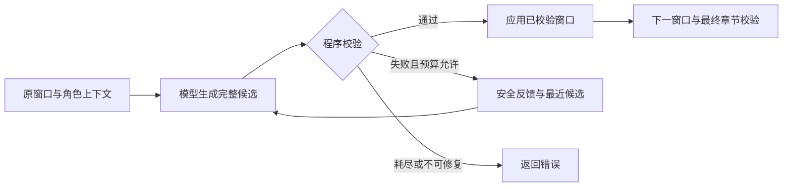

# 单章模型分析

模型每个窗口联合发现角色并判断表达及归属；首次候选无效时，默认允许一次校验反馈修复。程序负责正文快照、片段、窗口、ID、范围和完整校验；模型建议与持久化 DTO 分开。结果是候选产物，结构校验不证明语义准确。

## GLM 配置

现已支持本地服务：配置 `MODEL_BACKEND=local`，或使用 `--backend local`，详见 [本地模型用法](local-model.md)。以下 GLM 变量仅在 glm 后端使用；无后端选择时继续兼容默认 glm。

国内 MiniMax 使用 `--backend minimax` 和独立 `MINIMAX_*` 变量，见 [配置与参数](minimax-model.md)。提示词版本 5 为所有后端增加证据优先规则；输出协议及程序校验不变，语义质量以对照结果为准。

CLI 读取当前目录可选 `.env`，或 `--env-file` 指定文件，进程已有环境变量优先；文件解析不会修改进程环境。使用 `.env.example` 中的 `MODEL`、`API_BASE_URL`、`BIGMODEL_API_KEY`，与 comfy-agent 同名。配置缺失使用模型 `bigmodel::glm-4.6` 和 Coding Plan 端点默认值，密钥必填。显式空值报错，不悄悄切换服务端点。

`castglean-model` 的 `GlmConfig::new(model, endpoint, api_key)` 接收三项显式值，再由 `GlmModel::new` 构造适配器。首版只接受 bigmodel:: 前缀，普通文本 JSON 建议无需模型工具调用。失败只暴露认证、限流、网络服务、配置或响应类别，不打印 SDK 原始错误。

输出默认启用 JSON mode。库通过 `with_output_mode(GlmOutputMode)`，CLI 通过 `OUTPUT_MODE=json|schema|tool` 或 `--output-mode` 显式选择；优先级为参数、进程环境、环境文件、json。schema 请求严格 Schema，tool 强制单次 submit_analysis 参数返回，两者的服务端约束能力仍需按端点验证。工具不执行副作用或循环，模式失败不自动降级。真实能力探测、失败记录和默认选择依据见 [结构化输出接入](structured-output.md)。

真实 `.env` 已被 Git 忽略，`.env.example` 只有占位值。CLI 不加载 comfy-agent 文件或依赖其运行服务；本地一次性迁移后两项目配置独立。

思考预算默认显式发送 `low`，可使用 `REASONING_EFFORT=low|high|max` 或 `--reasoning-effort`；优先级为 CLI 参数 > 进程环境 > 环境文件 > low。库通过 `GlmConfig::with_reasoning_effort(GlmReasoningEffort::High)` 显式调整。这些等级依模型能力支持，不承诺所有 GLM 型号都识别；不支持时不会自动换模型或重试。GLM-5.3-Flash 的官方说明指出，省略等级默认 max，因此本项目不依赖服务默认值。[官方模型说明](https://github.com/zai-org/GLM-5#note)

## CLI 使用

```bash
cargo run -- analyze --source examples/minimal/chapter.txt --book demo --chapter ch-001 --output runs/demo
cargo run -- validate --characters runs/demo/characters.json --annotations runs/demo/chapter.annotations.json --source runs/demo/chapter.txt
```

`--output` 必须是新目录；成功发布 `characters.json`、`chapter.annotations.json`、`chapter.txt` 和 `analysis.stats.json`。输入正文只规范化换行，原文件不修改；失败不会发布最终目录，Ctrl-C 取消请求。可使用 `--window-chars`、`--window-segments`、`--max-requests`、`--max-output-tokens`、`--timeout-secs`、`--max-repairs-per-window`、`--chapter-timeout-secs` 调整预算。

CLI 首版每次从空角色表分析单章。已有上下文的库调用不等于已提供跨章 CLI 管理；重分析、人工修正和恢复尚未交付。新目录暂不支持多个发布者并发争用同一路径，也不承诺掉电恢复或多文件状态事务。

## 库接口

`analyze_chapter` 接收 `AnalysisModel`、`AnalysisInput`、`AnalysisOptions` 和 `CancellationToken`。调用方提供启用时间驱动的 Tokio 运行时；库不创建运行时、读取 `.env` 或保存文件。

首次分析使用 `context: None`。可选上下文必须是包含全部证据章节的 `ValidatedBook`；函数克隆上下文，保留已有角色、人工确认及正文，不覆盖原对象。新章 ID 已存在时拒绝，重分析及修正工作流留在阶段 C。新增角色时，候选角色表修订加一，候选旧章只更新修订引用，调用方需要整体消费新的候选书籍。

`AnalysisModel::generate` 接收 system/user 文本和输出 token 上限，返回文本、截断标记和可选用量。测试替身可完全离线运行：

```bash
cargo run -p castglean-core --example analyze_offline
```

示例保留未知，不用于评估模型质量。完整应用示例在 `crates/core/examples/analyze_offline.rs`。

## 分区与建议

切片版本 1 按换行、引号边界、冒号和句末标点切分（句末紧邻闭引号时保留同片段），长片段按 Unicode 字符边界细分。片段 ID 包含规则版本、正文摘要及字节范围；重复台词仍有不同 ID。切片只决定位置，不决定语义。嵌套语义层、无引号心理活动的精确边界仍可能需要后续改进。

窗口只接受 target 片段的标注，附带相邻片段作为只读上下文。已接受角色进入下一请求，模型临时引用只在本次响应中有效；已有身份使用显式 existing 引用，同名不自动合并。已有角色字段不能通过此协议修改。

建议拒绝未知字段、目标遗漏或重复、目标外标注、无效身份和不可见证据。新角色、确定及歧义归属要求证据，未知允许无证据；模型不能写入 confirmed。协议的 Rust 类型为 `AnalysisSuggestion`、`CharacterSuggestion`、`SegmentSuggestion` 和 `SuggestedAttribution`。

## 预算与失败

默认片段 160 字符、窗口最多 3000 字符且最多 24 个目标片段、两侧各 3 个上下文片段，最多 32 请求；每请求最多 128000 输入字节、8192 输出 token，响应文本最多 256000 字节，120 秒单请求超时、600 秒章节时限，每窗口最多一次修复。这些是可调工程默认值，尚无质量门槛承诺。

单请求输出 token 上限传递给适配器，输入字节不是 token 估算。实际用量可缺失，统计中保留 null，不承诺硬总 token 上限。运行统计记录模型、端点、提示词/切片版本和预算，不含密钥。核心响应字节检查在适配器返回后执行；GLM 的 genai SDK 先读取响应，这不是网络层内存限额。本地及 MiniMax 适配器另在 HTTP 接收时限制 1 MiB。

`analysis.stats.json` 另记录请求的 `reasoning_effort`、每次 `usage[].reasoning` 与 `response_bytes[]`。`output` 保留服务端完成 token 总数，可能包含推理；`reasoning` 仅采用服务端明细，缺失为 null。`response_bytes` 是最终建议文本的 UTF-8 字节数，不含思考正文，不用于推算 token。旧统计缺少新字段仍可读取；旧运行无法事后还原推理占比。请求等级只证明传参，不证明服务端执行了指定预算。

请求数预先检查；首次和修复共享总次数，修复前为后续窗口各预留一次首次调用。章节时限覆盖准备、模型调用和最终校验；同步计算在前后检查时限，不承诺计算中途可抢占。截断、输出大小超限、认证、配置、服务错误及请求超时直接失败，不做网络重试。未知及歧义是有效分析状态，不触发修复。

## 有限校验反馈修复

`AnalysisOptions::max_repairs_per_window` 默认 1，`chapter_timeout` 默认 600 秒；CLI 对应 `--max-repairs-per-window` 与 `--chapter-timeout-secs`。设 `--max-repairs-per-window 0` 可复现一次生成后失败即停。有限修复最初使用提示词版本 2；当前版本见上方说明，切分版本保持 1。

真实样例对照、受控错误回放及结论边界见[有限修复对照](analysis-repair-baseline.md)。

建议解析或业务校验失败后，程序生成 `SuggestionIssue`：固定错误码、应用生成的字段位置和必要的可信片段 ID。不回传原始解析错误，也不把模型提供的错误字段或 ID 写入诊断。每次只返回首个问题，模型重新提交完整窗口；不做局部补丁合并。

修复请求保留原窗口输入，加上 `repair.issue` 和字符串形式的 `repair.previous_candidate`；后者仅为数据，不进入正式角色上下文。超过输入字节限制时先省略旧候选；原输入和反馈仍超限则失败。只保留最近一次失败，不累积会话历史。

校验与应用分离：校验只读角色和片段，生成内部已校验窗口，随后应用；整章再次校验后才返回候选书籍。修复耗尽返回 `AnalysisError::RepairExhausted(SuggestionIssue)`；关闭修复保留静态 `Suggestion` 错误。失败仍不发布最终目录。



成功运行的 `requests`、`usage[]`、`response_bytes[]` 包含被拒绝的候选响应，`repair_requests` 记录取得响应的修复调用，`repaired_windows` 记录修复后接受的窗口。缺失 usage 保留 null；旧统计缺少两个修复字段时默认 0。失败分析当前只返回错误，没有完整失败调用统计；不从成功统计推算失败调用成本。取消和丢弃 future 都不提交部分结果；本地取消无法保证远端停算或不计费。
