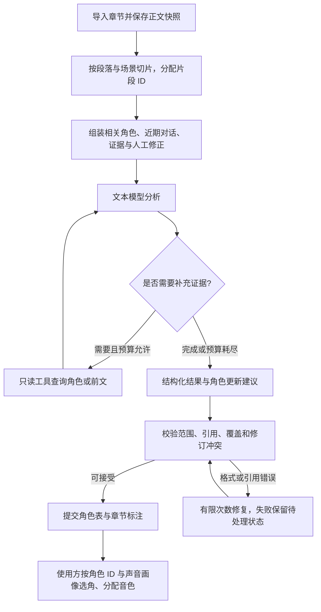

# CastGlean · 拾角：项目企划

日期：2026-10-05，2026-10-06 修订。状态：独立项目企划；阶段 A 离线快照、草案类型、Schema、校验器与 CLI validate 已实现，阶段 B GLM 单章分析已实现，跨章身份及修正仍后置。已实现接口与草案约束见 [data-format.md](data-format.md)。

## 项目定位与目标

做一个独立的 Rust 项目，把小说原文转换为可复用的角色表和章节标注。TRNovel 是第一个使用方，用标注结果实现多角色听书；其他阅读器或内容工具也可以使用。

同时继续 `../rust-agent/comfy-agent` 的学习：从固定分析流程开始，再加入工具调用、上下文组装、持久化记忆、执行记录和断点恢复。每一步都用中文小说场景检验效果，避免先搭通用平台却没有可验证的任务。

项目名为 CastGlean（拾角），仓库名为 `castglean`；CLI 名为 `castglean`，已实现 analyze 和 validate，状态管理命令仍在规划中。新仓库可以直接以本企划作为初始设计依据；TRNovel 的听书后端另见 [听书演进计划](https://github.com/yexiyue/TRNovel/blob/main/dev-notes/tts-backend-plan.md)。

## 功能范围与项目边界

首版支持导入本地 UTF-8 章节，按场景分析谁在说话、谁被提及，以及不同称呼是否属于同一个角色。连续处理多章时保持角色 ID 一致，保存标注并允许人工修正。文本模型可以是用户本地部署的服务，也可以是线上厂商 API。

角色分析项目负责：原文快照、切片、角色及别名、台词归属、有限上下文、模型调用、结果校验、修订记录和可选工具循环。

TRNovel 负责：获取章节、阅读 UI、选角与音色绑定、TTS 后端、音频缓存和播放。角色分析结果只引用稳定角色 ID，可选携带带证据的语义声音画像（性别、年龄段、气质/声线印象），不包含 Qwen3-TTS、MOSS Nano 或 Kokoro 的具体音色参数——同一画像由使用方映射到各自后端的音色。

首版不做网络小说抓取、TTS 推理、自动音色设计、向量数据库、图数据库、多人 agent 协作或管理后台。先使用自研 JSON 格式，标准导出等有实际使用需求后再设计。

## 使用方式

用户导入一章或按顺序导入多章，选择模型服务，执行分析，再查看或修正标注。重复分析相同输入可以复用缓存；模型不可用时保留已完成的结果，允许下次恢复。

当前 analyze 用法见 [模型分析](model-analysis.md)。以下为后续 CLI 状态管理的预期形态，命令与参数尚未冻结。下面的 `validate --book-id` 仍为未来书籍工作目录接口；当前已实现的 validate 使用显式角色表、标注和正文路径，见 [离线用法](data-format.md#使用已实现的离线入口)：

```bash
castglean analyze chapter.txt --book-id demo --chapter-id ch-001 --profile local
castglean inspect --book-id demo --chapter-id ch-001
castglean validate --book-id demo
castglean resume --run-id <run-id>
castglean correct --book-id demo --chapter-id ch-001 --file corrections.json
```

以独立、通用的 Rust library 为主要交付，同时提供调用同一套库能力的 CLI。先在本项目完成独立能力验收，最后接入计划中的首个使用方 TRNovel，优先直接调用 library；核心接口不绑定 TRNovel 的类型、存储或 TTS。JSON 产物用于离线交换、检查及 CLI 使用，进程协议保留为后续可选路径。业务逻辑不得仅存在于 CLI。HTTP 服务后置，不作为首版依赖。

## 整体流程



主流程由程序决定。正常场景一次分析完成；遇到角色歧义时再启用工具循环。格式重试和业务工具检索分别计数，并共享总请求、token 与时间预算。

## 分析任务拆分

不要让模型一次负责切分原文、计算偏移、生成角色 ID、归并人物和写文件。程序负责稳定结构，模型负责语义判断。

1. 程序保存不可变正文快照，分配章内片段 ID；规则识别引号只是候选，不能认定所有引号都表示对话。模型介入前，程序可先对开篇章节做规则预扫描（引号、称呼模式，角色数设上限）生成种子角色表，供首次分析参考；多个独立实现收敛于此模式，种子仍需模型确认或否决。
2. 模型提取当前场景的提及，匹配已有角色，或提出新角色。新角色使用本次请求的临时引用，由程序分配正式 ID 并替换所有引用。
3. 模型为片段判断表达类型及角色归属，返回支持判断的片段 ID；需要更精细边界时，可提出原文引文，由程序在明确候选范围内定位并检查唯一性。
4. 程序验证输出，保存场景结果；后续场景读取已提交的角色记忆。单本书的角色更新按顺序提交，避免并发生成冲突身份。

基础类型为 `narration`、`speech`、`thought`、`quoted_text`。人物身份与片段功能分开：第一人称叙述者也可以对应一个人物；引述别人的话可以形成嵌套语义标注。

台词归属使用 `resolved`、`ambiguous`、`unknown`。未知说话人不等同旁白；播放时是否用旁白声音属于使用方的回退策略。群体齐声可以使用组实体或多个参与者，具体形式在最小协议测试时确定。

## 模型来源

模型客户端层直接参考 `../rust-agent/comfy-agent` 的做法，使用其同款 [genai](https://crates.io/crates/genai) crate（当前 `0.7.0-rc.1`，本次已核对 crate 源码）：模型名采用 `provider::model-id` 命名空间（如 `bigmodel::glm-4.6`）；`Client::builder()` 可按模型覆写端点，接入任意 OpenAI 兼容服务；`exec_chat_stream` 统一捕获 usage、停止原因与工具调用，供预算统计和执行记录使用。genai 0.7 原生包含 DeepSeek、Ollama、BigModel、QwenCloud/Aliyun、Gemini、Anthropic、OpenRouter 等适配器，并支持 JSON mode（`ChatResponseFormat::JsonMode`）与工具调用声明；本地与线上服务因此天然共享同一调用接口。公共配置包含服务地址、模型名、超时、输入/输出预算；认证信息使用环境变量（如 `DEEPSEEK_API_KEY`）或独立凭据配置，不写入角色表、标注或执行日志。

首个接入已选择 **GLM**，**DeepSeek 系列**作为后续候选：genai 的 DeepSeek 适配器使用 `deepseek::` 命名空间、`https://api.deepseek.com/v1/` 默认端点和 `DEEPSEEK_API_KEY` 凭据，其源码测试指向 `deepseek-v4-flash`；`deepseek-v3-flash` 这一名称未在公开资料与 genai 源码中核实到，接入时以 DeepSeek 官方模型列表为准。不能只凭“OpenAI 兼容”就假定各服务能力一致：分别记录 JSON 输出、JSON Schema、工具调用、思考模式和上下文预算的能力，允许厂商参数通过适配器传递。首版必须能用普通文本生成 + JSON 解析运行；缺少工具能力时使用固定工作流。

本地基线的预期按 2026-10-06 调研修正：未找到任何 1B 以下模型零样本胜任该任务家族的证据，已验证的最小零样本量级是 6B（GLM-6B 在 JY-QuotePlus 说话人识别约 76.6%）与 8B（Llama-3-8B 在英文 PDNC 约 89–90%），95% 以上的成绩均来自微调。因此本地基线改为 **7B–14B 级模型**（如 Qwen3-8B/14B，经 Ollama 或本地 OpenAI 兼容服务接入）；**Qwen3-0.6B** 降级为下限探测与微调候选，不作为基线预期——其上下文上限仅 32K，官方 scaling 对比也未包含 0.6B。[官方模型说明](https://huggingface.co/Qwen/Qwen3-0.6B)

所有服务都使用应用保存的角色记忆和标注。换模型不会删除角色 ID，但模型和提示词版本变化会影响分析缓存。发送线上请求时只发送本次所需原文与上下文；本地分析失败不自动切换线上，除非用户明确配置该策略。

## Agent loop 与工具

学习和复用 `comfy-agent` 基于 genai 的模型请求、工具注册、结果回填、checkpoint 和步数限制机制。新项目只需要相关通用接口，是否抽成共享 crate 在原型跑通后决定；不要为使用 loop 一并引入其 ComfyUI 工具和完整服务栈。

首版先建立无工具的固定流程。工具循环作为下一阶段可选模式，用同一批样本对比准确率、未知比例、延迟和成本。

2026-10-06 调研支持这一排序：Anthropic、OpenAI 与 LangChain 的工程指南一致建议结构明确的任务先用程序控制的工作流，agent 只在确定性方案不足时引入；MAST 对多 agent 系统的失败分析中，高频失败模式正是“步骤重复”与“不知何时终止”，硬预算恰好防范这两点。检索到的开源项目（Alexandria、audiobook-creator 及多个中文项目）全部采用程序控制流水线，未发现任何在小说归属任务上让模型自主选择工具的先例；最接近的邻域证据是 ReacTOD（有界 ReAct 循环 + 确定性校验器，在对话状态跟踪上比单遍高 9.3 分），支持把有界循环保留为对照实验而非默认路径。

| 工具 | 输入与返回 | 边界 |
| --- | --- | --- |
| `lookup_character` | 姓名或别名 → 候选角色 ID、相关别名、证据位置 | 别名允许一对多，不自行合并 |
| `read_passage` | 章节 ID、段落范围 → 原文、片段 ID、位置 | 限本书已导入章节，限制返回长度 |
| `search_evidence` | 查询词、截止章节 → 相关原文与位置 | 截止章节由程序控制，模型不能扩大范围 |

工具只读。新增角色、合并身份和修改别名以结构化建议提交，由程序校验后落盘。先用姓名/别名索引与原文检索；不依赖向量召回来维持角色一致性。

初始检索预算可设为每场景最多三轮，最终数值通过评测调节。达到预算后允许返回未知；不能靠不断重试逼模型给出确定角色。执行记录保存模型配置、提示词版本、工具参数及证据引用，支持回放排查，敏感凭据必须排除。

## 上下文与记忆

### 长期记忆：本书角色注册表

保存稳定角色 ID、主名、别名、必要事实、可选语义声音画像、出处、人工确认和修订历史。名字只是属性；“老张”“父亲”“师兄”都可能指不同人物，不能建立强制唯一的名字到角色映射。

角色事实带证据和获知章节。跨章检索按当前分析边界组装视图，避免用未来才揭示的身份反向影响前面的增量分析。首版聚焦当前章节可知信息；全书分析后统一重审属于后续模式。声音画像遵循同样纪律：性别、年龄段、气质/声线印象（如“御姐”“少年音”）可选、可缺失、带出处章节，正文未描写时不做猜测性填充；画像更新不影响已提交的归属标注，只影响使用方的选角结果。

### 短期记忆：场景状态

保存当前参与者、最近对话归属和与当前片段相关的事实。场景状态是程序维护的结构化数据，不是模型随意撰写且不断累积的摘要。换场景后仅保留仍有依据的状态。

### 工作记录：本次运行

保存本次模型消息、工具调用、预算及 checkpoint。每个场景重新组装上下文，不把整本书的聊天历史一直塞进模型。checkpoint 可以保存未提交建议，恢复时要检查正文与角色表版本，防止提交过期结果。

人工修正拥有最高优先级。模型输出的身份合并不得覆盖人工约束，角色合并保留旧 ID 重定向及历史以便撤销；模型自报置信度不能当成校准概率或唯一合并依据。

## 自研 JSON 格式

内部与对外交付都先使用同一套简单 JSON。参考成熟标注思路，但不宣称是 TEI 或 W3C 标准；不以兼容其他格式为首版目标。

| 产物 | 核心内容 |
| --- | --- |
| `characters.json` | `format_version`、`book_id`、`revision`、角色 ID、显示名、别名、可选语义声音画像、证据、确认状态与合并记录 |
| `chapters/<id>.annotations.json` | 格式版本、章 ID、正文摘要、规范化版本、角色表版本、片段范围、表达类型、归属及证据、分析来源 |
| `chapters/<id>.txt` | 标注引用的不可变 UTF-8 正文快照 |
| `corrections/` | 人工修改及其基于的正文/标注版本 |
| `runs/` | 可恢复的执行 checkpoint 和诊断记录 |

音色配置属于使用方，分析输出不要求 `voice-bindings.json`；角色表可携带语义声音画像，由使用方映射为后端音色。角色表中的事实与别名也可以引用章节标注的证据，而不重复复制大量正文。

### 坐标、版本与校验约定

- 章内范围使用 UTF-8 字节数、从 0 开始、左闭右开 `[start, end)`，范围必须在 Unicode 字符边界上。不要混用 code point、UTF-16 长度、token ID 或屏幕列数。
- 标注前固定文本规范化规则。建议首版将 CRLF/CR 转为 LF，保留其余空白与 Unicode 内容；章节标题由元数据保存，不拼进正文。摘要与偏移都针对规范化后保存的正文快照，另存导入源摘要和规范化版本。
- 程序校验所有片段按原文顺序、不重不漏；空白也有归属，但播放可以跳过。模型只引用预分配片段 ID，不自行计算字节偏移。
- 朗读片段与语义台词分层：片段形成正文分区，台词可引用多个范围，支持被“他说”打断的表达；嵌套引语可以重叠，但朗读顺序不能因此重复正文。
- 角色和片段 ID 不是数组下标。正文版本变化不能沿用旧范围；需要保留人工修正时进行显式映射，失败则标记待处理，不静默移动。
- 核心文档发布 JSON Schema 及有效/无效样例。Schema 校验结构，程序额外校验跨文件引用、原文范围、正文覆盖和修订冲突。
- 首个对外版本发布时冻结 `format_version: 1`；未知主版本拒绝解析。扩展字段集中放入明确的 `extensions` 空间，核心字段拼写错误应被拒绝。
- 归属状态与人工确认分开：`resolved` 表示本次分析得到确定结果，不自动表示已由人确认。未知状态允许空角色 ID，歧义状态保留候选。

### 字段示意

以下是核心字段片段，不是已经冻结的完整 Schema。原文是 `张三说：“走吧。”`，没有尾换行，总计 27 个 UTF-8 字节。真实角色 ID 由程序生成，示例使用便于阅读的短 ID。

角色表字段：

```json
{
  "format_version": 1,
  "book_id": "demo",
  "revision": 1,
  "characters": [
    {
      "id": "char-001",
      "display_name": "张三",
      "aliases": [],
      "review_status": "unreviewed",
      "evidence": [{ "chapter_id": "ch-001", "segment_id": "seg-001" }],
      "voice_profile": {
        "gender": "unknown",
        "age_band": "unknown",
        "impressions": [],
        "evidence": []
      }
    }
  ]
}
```

`voice_profile` 是可选的语义声音画像：性别、年龄段和自由文本的声线印象（如“御姐”“少年音”“沙哑”），各项可缺失并各自带证据。示例正文没有描写张三的声线，因此全部保持 unknown/空——缺失不是错误，使用方回退默认音色即可；原文出现“低沉沙哑的中年嗓音”一类描写时才填入并引用片段。画像供使用方选角，不含任何后端音色参数。

章节标注字段：

```json
{
  "format_version": 1,
  "book_id": "demo",
  "chapter_id": "ch-001",
  "character_revision": 1,
  "source": {
    "sha256": "693d2f4dc01c19056a2dbf0fddf40a6c5c64f7690d0ba336727eb7c884a7a20f",
    "import_sha256": "693d2f4dc01c19056a2dbf0fddf40a6c5c64f7690d0ba336727eb7c884a7a20f",
    "normalization_version": 1,
    "offset_unit": "utf8_byte"
  },
  "segments": [
    {
      "id": "seg-001",
      "start": 0,
      "end": 12,
      "kind": "narration"
    },
    {
      "id": "seg-002",
      "start": 12,
      "end": 27,
      "kind": "speech",
      "attribution": {
        "status": "resolved",
        "character_id": "char-001",
        "evidence_segment_ids": ["seg-001"],
        "review_status": "unreviewed"
      }
    }
  ]
}
```

模型输出与上述持久化格式分别设计。模型只返回归属和角色更新建议，程序填充摘要、正式 ID、范围、修订号及运行来源。表达方式/情绪先做可选字段，未分析不能自动写成“中性”；它们不应阻塞基本角色归属。声音画像遵循同一规则：作为角色更新建议的一部分可选返回，缺失不阻塞归属，也不自动填充默认气质；逐角色的画像用于选音色，与逐片段的情绪字段互补。

## 持久化、缓存与恢复

首版以 JSON 和正文文件交付即可，暂不要求数据库。单本书串行提交，以原子替换和提交清单保证角色表与章节标注不会出现半次更新；具体文件布局与恢复协议在实现阶段确定。

分析缓存至少包含正文摘要、切片版本、模型配置指纹、提示词版本、角色上下文版本及人工修正版本。角色上下文改变时采用保守失效：重新检查受影响章及后续依赖场景，不只看当前正文。缓存失效意味着重新分析，不删除用户修正。

checkpoint 区分待分析、运行中、待校验、已提交、失败和已取消。取消后不提交迟到结果；中断恢复时跳过已经完整提交的场景。外部请求可能重复发送，应记录这一限制，不承诺厂商调用恰好一次；本地提交按运行/场景 ID 去重。

角色合并、撤销和人工修正形成修订记录。第一版可以先支持归属修正和别名修正，再加入完整合并/撤销 UI；即使暂时没有 UI，也要避免数据结构阻断这些操作。

## 技术架构与模块边界

初始工程已选择三个 crate 的 workspace：`castglean-core`（下表中的 domain/document/analysis/agent/memory/storage）、`castglean-model`（model）、`castglean-cli`（cli）。核心不依赖模型适配，CLI 负责装配。domain、document、JSON 助手及独立 validation 已实现阶段 A；固定窗口分析与 GLM 适配已实现；状态、检索和工具循环仍为职责占位，详细工程说明见 [engineering.md](engineering.md)：

| 模块 | 职责 |
| --- | --- |
| `domain` | 角色、片段、归属、证据和修订类型 |
| `document` | 正文导入、规范化、切片与坐标校验 |
| `model` | 基于 genai 的本地/线上服务接入、能力描述与端点/凭据配置 |
| `analysis` | 固定流程、上下文组装和结果验证 |
| `agent` | 有预算的工具循环与执行状态 |
| `memory` | 角色索引、场景状态及证据检索 |
| `storage` | JSON、缓存、修订和 checkpoint |
| `cli` | 用户命令、配置与诊断输出 |

核心领域类型不依赖特定厂商响应结构。工具不直接操作存储提交；分析器输出可验证结果，由工作流决定何时提交。CLI 错误信息区分网络失败、无效输出、歧义归属和版本冲突。

## 实现阶段与学习目标

| 阶段 | 交付 | 学习与验收重点 |
| --- | --- | --- |
| A：格式与离线样例（已实现） | 正文快照、草案类型、Schema、校验器、人工样例及 library/CLI | UTF-8、覆盖与引用；首次发布前再冻结 v1 |
| B：固定模型流程（已实现） | GLM 适配、顺序窗口分析和未知回退 | Prompt、上下文预算、结构化输出与质量评测 |
| C：跨章身份与修正 | 稳定角色 ID、别名证据、人工修正、修订与基础一致提交 | 记忆与 history 的区别，状态一致性 |
| D：可靠运行与独立交付 | 持久化、缓存失效、checkpoint、取消恢复与发布检查 | 独立运行，提交一致性，故障恢复和协议边界 |
| E：可选工具增强 | 三个只读工具、硬预算、执行记录与对照评测 | model → tool → model，检索边界与终止；对比 B 的收益 |
| F：外部集成 | 最后接入 TRNovel，以角色 ID 驱动选角与音色映射 | 消费通用库，画像缺失回退默认，分析失败时普通听书仍可运行 |

阶段之间先验证再扩大，具体实施顺序与验收标准见 [实现路线图](implementation-roadmap.md)。阶段 B/C 已经可以提供实际价值；先保证独立库与 CLI 的通用能力，再进行外部集成，工具循环不是交付或集成的前置条件。

## 评测与首版验收

建立自编或可分发的中文小语料，人工标注预期归属，至少覆盖：明确说话人、连续省略说话人、多人交替、代词指代、同名/同称呼、跨章别名、心理活动、第一人称旁白、非对话引号、嵌套引语、旁白打断台词和未知说话人。声音画像样例额外覆盖声线从未描写、性别晚揭示与跨章画像更新。

评测集不必从零标注：可用 **JY-QuotePlus**（8,144 条《射雕英雄传》引语，说话人与听话人双标注，标注一致性 99%+，仓库含 17.2 MB JSON 可下载但无 license 文件——先用于内部评测，分发前需联系作者；JY-Quote4 仓库本轮确认为空壳）和 **CSI**（18 本中文小说，NAACL 2022，仓库带 license.txt）作为种子语料。已有参考数字：零/少样本提示下 GPT-3.5 说话人+听话人双正确率约 70–79%、GLM-6B 约 66–70%，微调后的 PromptCLUE 达 95.07；本项目基线报告应与这些数字对照。

工程样例额外覆盖中文/英文/emoji、组合字符、CRLF、空行、重复台词、空章、极长段落、模型超时/输出截断/无效 JSON、工具预算耗尽、人工修改与版本冲突、中断恢复及取消后的迟到响应。

分别统计角色归并错误、台词归属正确率、未知/歧义比例、已确定结果准确率、覆盖率、人工修正量、每章请求数/token/耗时及工具轮数。固定流程与 agent loop 使用相同样本对照；不同模型配置分别报告，不能用更低未知率掩盖更多错认。

首版工程验收要求：

- JSON 结构、角色引用、Unicode 边界和正文覆盖全部通过校验。
- 连续处理多章时，同一确认身份保持相同角色 ID；重名角色不被强制合并。
- 换模型、重分析和恢复运行都保留人工修正；正文变化不继续使用旧范围。
- 工具不能读取其他书籍、未来章节或任意系统文件；凭据不进入产物及日志。
- 中断后可恢复已提交工作；校验失败和未知归属不会伪装成成功的确定结果。
- TRNovel 能消费产物并保持角色声音一致；声音画像可缺失，缺失或未确认时回退默认音色，分析不可用时普通旁白模式可用。

准确率目标在阶段 A 的样本和阶段 B 的基线结果出来后确定，不预先声称特定模型规模或加入工具必然达标。新仓库建立自己的格式、测试、Clippy 和 rustdoc 检查；纯企划阶段不记录未运行的模型测试为通过。

## 公开实现参考

这些来源用于理解已有做法与语义边界，不作为本项目格式兼容承诺：

- [Alexandria 生成流程](https://github.com/Finrandojin/alexandria-audiobook/blob/main/app/generate_script.py)：分块时提供已有角色名和近期标注；程序控制调用顺序。
- [Audiobook Creator 角色分析](https://github.com/prakharsr/audiobook-creator/blob/main/utils/character_extraction_llm.py)：先建立角色表，再结合前后文匹配台词；使用结构化输出与重试。
- [PDNC](https://github.com/Priya22/project-dialogism-novel-corpus)：角色 ID/别名、说话人/听话人、台词子范围及归属线索。
- [TEI said](https://tei-c.org/release/doc/tei-p5-doc/en/html/ref-said.html)：人物与表达分离，以及心理活动、间接表达等语义。
- [W3C Web Annotation](https://www.w3.org/TR/annotation-model/)：原文定位和标注来源；其字符坐标不能直接当作 UTF-8 字节范围。

2026-10-06 补充的调研参考：

- [Llama-3 说话人归属（NAACL 2025）](https://arxiv.org/abs/2406.11380)：滑窗切块 + 注入角色别名表 + JSON 输出 + 块间增量状态传递，与本企划固定流程几乎同构；零样本约 88.5–90.6%。
- [ModernBookNLP](https://arxiv.org/abs/2608.02359)：149M 微调编码器在 PDNC 达 94.5%，说明“小模型微调”与“大模型提示”是两条并行路线。
- [JY-QuotePlus（NLPCC 2024）](https://arxiv.org/abs/2408.09452)：中文引语说话人/听话人语料与基线；[数据仓库](https://github.com/LimboChen/JY-QuotePlus)、[CSI 数据集](https://github.com/yudiandiris/csi)。
- [one-who-reads-aloud-v2](https://github.com/ch4ngingstar/one-who-reads-aloud-v2)：确定性分段 + 语法约束解码，模型从不改写原文——验证“程序管结构、模型只管语义”。
- [storyforge](https://github.com/EstimateFaster/storyforge)：规则预扫描种子角色表、每章注入注册表、输出覆盖校验 + 一次修复。
- [Anthropic Building Effective Agents](https://www.anthropic.com/research/building-effective-agents)、[MAST](https://arxiv.org/abs/2503.13657)、[ReacTOD](https://arxiv.org/abs/2605.19077)：工作流优先、多 agent 失败模式与有界循环收益的依据。

## 风险与应对

| 风险 | 影响 | 应对措施 |
| --- | --- | --- |
| 小模型语义能力不足 | 别名误合并、隐式台词错认 | 先建立人工基线，保留未知结果，允许选择更强模型 |
| 角色记忆发生错误传播 | 后续章节沿用错误身份 | 保存证据与修订来源，优先人工约束，支持失效重分析与合并撤销 |
| 工具循环收益有限 | 成本和延迟增加而准确率不变 | 固定流程作为对照，工具模式可关闭，设置请求与时间预算 |
| 文本切分不准确 | 台词与叙述边界错误、上下文不足 | 分离朗读片段与语义标注，保留原文映射，覆盖嵌套与中断台词样例 |
| 服务协议差异 | 本地/线上模型无法互换 | 独立适配器与能力描述，不把可选能力设为核心运行前提 |
| 原文与产物版本不一致 | 标注位置错误、缓存误用 | 正文摘要、角色修订与规范化版本联合校验，显式处理失效 |
| 共享代码引入过多依赖 | 首版维护与部署复杂度上升 | 先复用学习机制和最小接口，原型验证后再抽公共 crate |

## 交付物与资源安排

首版交付独立仓库、Rust library 与 CLI、自研 v1 JSON 格式说明及 Schema、有效/无效样例、中文评测集与基线报告、运行/配置文档，以及 TRNovel 的最小消费示例。工具模式另附固定流程对照结果和中断恢复测试记录。

开发环境需要 Rust 工具链、可调用的本地文本模型服务或线上 API，以及可分发的测试正文。硬件要求由实际选择的模型与推理服务确定；本项目核心不绑定 GPU。API 费用、性能与模型效果在基线评测中记录。

当前不承诺开发周期，按阶段交付和验收推进。若模型效果或资源不足，先交付人工标注与验证流程，并继续评估自动分析；不能降低原文完整性与人工修正保护要求来换取进度。

## 待决策事项

- crate 组织已定为 core / model / CLI 三包；CLI 名为 castglean，采用 MIT 许可证，包暂不发布；正式发布策略待定。
- 首个接入方向已选择参考 `../rust-agent/comfy-agent` 的现有 GLM 配置；当前 GLM 运行配置和预算基线已记录在 [模型分析](model-analysis.md) 与 [基线报告](stage-b-baseline.md)，后续能力按评测扩展。DeepSeek 和本地 7B+ 保留为后续候选。
- 场景切分粒度、片段修订策略及群体发言的数据表达。
- 声音画像的字段集、取值词表与缺失回退策略。
- 核心 v1 字段、扩展策略、角色合并与撤销协议。
- 基线样本规模、质量门槛、可接受延迟与成本预算。
- comfy-agent 通用能力采用独立实现、共享 crate 还是后续抽取。
- 独立库公开 API、状态持久化边界与协议按通用任务设计；最后集成 TRNovel 时确认宿主适配和正文坐标映射，优先直接调用 Rust library，文件交换及进程协议按后续需要补充。

以上事项在各阶段进入实现前确定，未决定的部分不作为已实现能力描述。

## 启动步骤

阶段 A 已用三个自编场景跑通“正文快照 → 校验 → JSON 读写与消费”，阶段 B 已完成单章固定分析与真实小样本基线，见 [模型分析](model-analysis.md)；接下来按 [实现路线图](implementation-roadmap.md) 进入身份与修正。经 genai 参考 comfy-agent 的 GLM 配置建立基线，在首次对外发布前冻结 v1。暂不复制完整 comfy-agent 服务栈，也不同时实现全部模型后端；TRNovel 在独立能力验收后最后接入。
