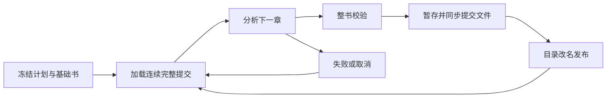

# 章节级持久化与恢复

`BookRun` 提供独立的 JSON 运行存储。库显式接收调用方路径、模型、配置及取消信号；CLI 在这一能力上装配 GLM、本地或 MiniMax。恢复单位为完整章节：已提交章不会再次调用模型，中断中的章重新开始，不复用未校验候选。

## 权威状态与边界

运行根目录保存冻结的 `manifest.json`，其中包含基础 `BookDocument`、有序正文快照与 `RunConfig`。`commits/00000001/commit.json` 等顺序目录各含整书、成功章节统计、计划指纹、父提交摘要及序号。完整目录发布后才构成 checkpoint；没有另写的活动指针或进度文件。临时 `.pending-*` 目录不计入进度，崩溃遗留物由调用方管理。



恢复校验计划和提交摘要、连续序号、父链、共同修订、追加动作、原有身份及已保存章节，并重新执行整书校验。损坏正式提交会停止，不能被当作未执行章节重新覆盖。源摘要、切片、所有分析选项、模型非秘密描述、提示词版本、角色上下文与人工修订都进入指纹。改变这些输入须新建运行；新运行可以从修正后的快照开始，旧运行不会自动吸收外部修改。此轮没有跨运行缓存和窗口 checkpoint。

句柄持有操作系统排他文件锁，覆盖分析和提交，进程退出释放；协作进程同时打开返回 busy。锁仅协调同一运行，使用可信本地目录，不对抗外部编辑或恶意篡改。摘要是损坏检测，不是签名。

## 库用法

构造 `RunPlan { format_version: 1, base, chapters, config }`，通过 `RunChapter::new` 冻结 `SourceSnapshot`，`RunConfig::new` 填入当前协议版本。模型实例必须与配置描述一致，由宿主保证；库无法反查任意 `AnalysisModel` 的真实提供方。`implementation` 由宿主在分析行为变化时递增。CLI 使用 `castglean-cli/0.1.0/run-2`，后续行为改变须递增该标识。

```rust,ignore
let mut run = BookRun::create(path, plan)?;
while run.advance(&model, &config, &cancel).await? {}
// 中断后：
let mut recovered = BookRun::open(path)?;
recovered.check_config(&config)?;
while recovered.advance(&model, &config, &cancel).await? {}
```

可直接执行无凭据示例：

```powershell
cargo run -p castglean-core --example run_offline
```

失败及取消不提交当前章；提交 IO 错误后必须丢弃句柄再打开，以确认目录改名是否已完成。已经提交的数据保持不变。每章沿用冻结的请求/修复预算和章节时限，没有额外网络重试或后端回退。

## CLI 用法

公开计划示例为 `examples/run-recovery/glm-plan.json`，正文是自编两章。计划包含保存文本而非源路径，启动后不重新读取外部正文。修改 `config.model` 使之与当前后端实际配置一致；凭据只放忽略的 `.env`，不得写进计划或模型描述。

```powershell
cargo run -- run --plan examples/run-recovery/glm-plan.json --run-dir runs/demo-book --backend glm --max-chapters 1
cargo run -- resume --run-dir runs/demo-book --backend glm
cargo run -- resume --run-dir runs/demo-book --backend glm
cargo run -- run-inspect --run-dir runs/demo-book --output runs/demo-export
cargo run -- validate --book-file runs/demo-export/book.json
```

`--max-chapters` 只控制本次最多新增多少章节，不改变冻结计划。`run-inspect` 不需要模型或凭据，显示指纹、进度、修订和成功提交统计，可将当前书导出到新的目录。已有路径不覆盖。完整状态位于忽略目录，不应提交私有输入或产物。

## 统计与可靠性范围

只保存完整成功提交的实际调用统计，包括该章被拒绝后修复的响应。用量未知仍为 `null`。未提交调用可能已经计费，`uncommitted_usage` 保留 `null`，不能用成功统计推断全部历史花费。进程中断后的远程请求撤销与计费不可保证，恢复可能重复当前章请求。

写入提交文件后执行 `sync_all`；Unix 同步相关目录。Windows 已验证进程中断恢复，不宣称任意文件系统上的断电事务保证。[标准库锁 API](https://doc.rust-lang.org/std/fs/struct.File.html#method.try_lock) 从 Rust 1.89 起稳定，当前测试工具链为 Rust 1.98.1；全部依赖的最低版本、Linux 实机以及首次发布冻结仍是阶段 D 后续验收。离线与 GLM 记录见 [有限验收](run-recovery-verification.md)。

## 本次失败的响应统计

`advance_detailed` 的分析错误保留安全诊断和本次失败统计，不改变已提交 progress。CLI 的 `--failure-report` 将其写到宿主显式提供的新文件；成功不生成失败报告。它不是 checkpoint，恢复不读取该报告、不复用私有窗口候选。恢复仍可能重复当前章模型请求；历史未提交用量继续未知。详细统计规则见 [模型分析](model-analysis.md#失败诊断草案)。
